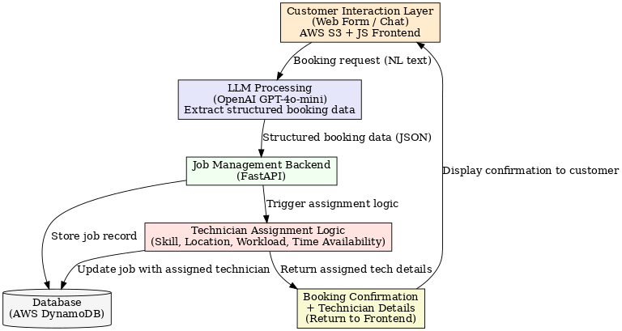
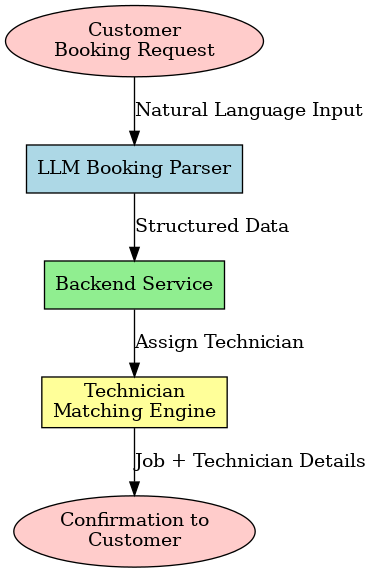

# End-to-End Service Management System

This project is a prototype **end-to-end service booking and technician assignment system**.  
It integrates **AWS (DynamoDB, S3)**, **OpenAI**, and a simple **frontend UI** for service booking.

---

## 📂 Project Structure

```bash
SERVICE_MANAGEMENT_SYSTEM/
│── .env                # Environment variables (NOT in git)
│── .gitignore
│── main.py             # Entry point
│── README.md           # Project documentation
│
├── docs/               # Documentation & notes
│   └── connect_to_dynamodb.txt
│
├── figure/             # Images & diagrams
│   ├── booking_pipeline.png
│   └── solution.png
│
├── front-end/          # Frontend files
│   └── index.html
│
├── src/                # Python source code
│   └── graph.py
│
├── test-case/          # Test datasets & notebooks
│   ├── insert_technicians.ipynb
│   └── testcase.txt
│
└── __pycache__/        # Auto-generated cache files
```

---

## 🚀 Setup

### 1. Clone repository
```bash
git clone https://github.com/TheDRXu/end_to_end_service_mgmt.git
cd end_to_end_service_mgmt
```

### 2. Create virtual environment (Anaconda/Miniconda)
```bash
conda create -n end_to_end_mgmt python=3.13 -y
conda activate end_to_end_mgmt
```

### 3. Install dependencies
```bash
pip install -r requirements.txt
```

### 4. Add `.env` file
```env
DDB_TABLE=end_to_end_service_mgmt
OPENAI_API_KEY=sk-xxxxxxx
AWS_ACCESS_KEY_ID=xxxxxxx
AWS_SECRET_ACCESS_KEY=xxxxxxx
AWS_SESSION_TOKEN=xxxxxxx
AWS_DEFAULT_REGION=ap-southeast-2
```
Or you can use aws configure to configure the aws settings
⚠️ Never commit `.env` to GitHub.

---

## ▶️ Run the Project

Start backend:
```bash
uvicorn main:app --host 0.0.0.0 --port 8000
```

API runs on:
```
http://localhost:8000
```

Open the frontend:
```
http://end-to-end-service-mgmt.s3-website-ap-southeast-2.amazonaws.com/
```

---

## 🛠 Features

- **AI-powered booking** – users can book via natural language.
- **Smart technician matching** – skills, location, workload, availability.
- **AWS backend** – DynamoDB for bookings, S3 for storage.
- **Frontend UI** – simple static booking page.

---

## 📊 Figures

Booking pipeline:



Solution overview:



---

## 📖 Test-case

- We provide two test-case, one for technicians (test-case/insert_technicians.ipynb) and one for customer testcase (test-case/testcase.txt)
